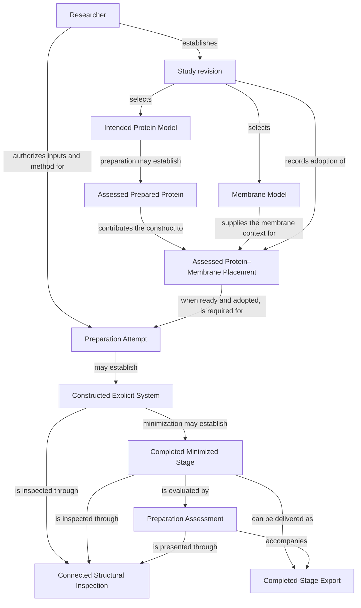

# Protein–Membrane Workspace

A local scientific application for preparing, constructing and inspecting all-atom protein–membrane systems through a connected workflow.

**AmberTools / PACKMOL-Memgen · OpenMM · Mol\***

**Protein preparation → membrane specification → placement → construction → minimization → inspection and export**

## Overview

Protein–Membrane Workspace connects the major steps required to prepare an all-atom protein–membrane system while preserving the relationship between researcher choices, scientific operations and the molecular results they produce.

## What the application enables

- **Protein preparation:** inspect a source structure, select the intended construct, and review structural repairs and chemical-state choices.
- **Membrane specification:** define the lipid composition of each leaflet, including asymmetric membranes.
- **Protein positioning:** translate and rotate the prepared protein relative to the membrane, with optional orientation assistance.
- **System construction:** build an explicit molecular system through AmberTools / PACKMOL-Memgen.
- **Energy minimization:** minimize the constructed system with OpenMM.
- **Structural inspection:** inspect molecular structures interactively with Mol\*.
- **Export:** save completed molecular artifacts with their parameters and provenance.

The sections below describe the researcher’s workflow and how it informs the requirements, conceptual model, abstraction boundaries, contracts and implementation.

## Run locally

On Linux or WSL, install the .NET 10 SDK, Node.js 22.12 or newer with npm, Python 3.11 with `venv` and `pip`, and Git. For the PACKMOL-Memgen construction route, also install `micromamba`; the build script uses it to create the pinned AmberTools environment if that environment is missing. The first build needs network access for package downloads. Check that `node --version` reports at least 22.12 before building.

From the repository root:

```bash
scripts/build-local.sh
scripts/start-local.sh
```

The build script installs the pinned browser and Python packages, builds the browser, publishes the .NET host, and attempts to prepare AmberTools when `micromamba` is available. It does **not** start the app. If AmberTools cannot be prepared, the PACKMOL-Memgen route is unavailable.

The start script runs the local host. Open **http://127.0.0.1:4185/** in a browser; use `Ctrl+C` in the terminal to stop the host. Studies and results persist in `out/workspace` across restarts. To use another port, start with `PIM_PORT=4186 scripts/start-local.sh`. Optional PPM orientation is detected at `out/ppm2/immers` or through `PIM_PPM_EXECUTABLE`; otherwise it is shown as unavailable.

## The researcher’s workflow

The workflow begins with a source protein structure. The researcher inspects the structure, selects an assembly and its chains, and decides which associated molecules belong in the intended construct. The application supports reviewing and applying a preparation plan, including structural repairs and chemical-state choices.

The researcher specifies the membrane by choosing the lipid composition of each leaflet. Separate upper and lower compositions allow asymmetric membranes to be represented. The prepared protein can then be translated and rotated relative to the membrane through direct positioning or with assistance from an orientation method. OPM supplies reference orientations for matching structures, while PPM calculates orientation estimates.

Once the researcher has selected a position, the application coordinates construction of the explicit molecular system. PACKMOL-Memgen, through AmberTools, supplies the general construction route, including molecular packing, parameterized output, and method-specific conditioning. The resulting topology and coordinates are passed to OpenMM for final energy minimization.

Throughout the workflow, Mol* provides interactive molecular representations and structural inspection. Completed results can be inspected and exported with their coordinates, topology, parameters, and provenance.

## From requirements to implementation

The development process progressively establishes the meaning that the software must preserve. Requirements describe the researcher’s work and the system’s responsibilities. Analysis establishes the conceptual world needed to support that work. Software design determines abstraction boundaries and contracts, which guide the organization and implementation of the code.

Protein placement provides a concrete example of this process.

### 1. Deriving the requirements

Requirements are derived by examining what the researcher is trying to accomplish, which decisions belong to them, and what the system must establish to support those decisions.

For placement, the starting activity can be expressed as follows:

> The researcher explores possible positions of a prepared protein relative to a membrane, reviews a candidate, and chooses the position to be used for construction.

This activity gives rise to several requirements. The application must support changing the position, assessing the resulting arrangement, presenting the assessment, and recording the researcher’s choice. Construction must subsequently use that chosen position.

Considering alternative sequences makes the requirements more precise. A researcher may edit a position while an earlier assessment is running. The earlier result must remain associated with the position it evaluated; it cannot establish readiness for the newer position.

Requirements therefore describe both the intended outcome and the behavior needed as the work proceeds through editing, calculation, review, and selection.

### 2. Establishing the conceptual world

Analysis develops a shared model of the subjects, decisions, operations, and results required by the researcher’s work. Each concept has a defined meaning, and its relationships explain how it participates in the system.

The diagram below is a **simplified view of the system’s top-level conceptual model**, focused on preparation through export. Detailed preparation decisions, assessment criteria, and supporting evidence relationships are omitted for readability. The arrows express conceptual relationships, not software calls.



The model distinguishes the researcher’s intended system from the molecular results established through calculation. A study revision records a particular set of researcher choices. Preparation establishes a particular construct, placement relates that construct to the chosen membrane, and adoption records the decision to use the arrangement.

A preparation attempt brings the selected inputs and authorized method together. Its resulting constructed system, completed minimized stage, and preparation assessment remain distinct concepts. This allows inspection and export to identify both the molecular result and the findings associated with it.

The placement requirement can now be understood within this larger model. Editing a candidate changes the proposal under consideration. Assessing it establishes findings about that proposal. Adopting it changes the study’s selected premise. A subsequent preparation attempt must correspond to that adopted premise.

At this stage, the model establishes meanings and relationships. It does not yet prescribe classes, processes, or deployment units.

### 3. Deriving abstraction boundaries

Software design determines how the responsibilities established through analysis should be organized. An abstraction boundary defines what a part of the software undertakes to do and which details its collaborators do not need to know.

In the placement example, study coordination records the researcher’s choices and determines which position subsequent construction uses. Placement assessment evaluates a proposed arrangement. Scientific-tool integration handles the execution conventions and representations required by the selected numerical method.

These responsibilities involve different knowledge. Study coordination needs to understand proposals, assessments, and adoption. It does not need to understand a PPM input file or the details of invoking a scientific executable. Scientific execution needs the inputs for its calculation, but it does not decide whether the researcher has adopted the result.

The boundary follows from this separation of responsibilities and knowledge. Provider-specific execution details remain encapsulated, while collaborating software depends on the meaning of the operation and its outcomes.

The same reasoning applies to protein preparation, membrane assessment, system construction, structural inspection, and completed-stage export. Boundaries are established around coherent responsibilities rather than around individual screens or external programs.

### 4. Designing the contracts

Once responsibilities have been separated, their collaboration must be specified. A contract establishes the inputs an operation requires, the outcomes it can produce, and the guarantees on which its collaborators may rely.

For placement assessment, the caller supplies an identified prepared protein, the membrane context, and a complete placement request. The outcome remains associated with those inputs and provides the resulting proposal and assessment, or an explicit explanation of why the operation could not be completed.

Several guarantees follow from the requirements and conceptual model:

- Findings concern the proposal that was actually evaluated.
- An assessment containing unfavorable findings remains distinguishable from a failure to perform the assessment.
- Producing an assessment does not adopt the proposal.
- The outcome retains sufficient input correspondence for the caller to distinguish it from results concerning other requests.

The final guarantee supports the earlier editing example. When a response arrives, study coordination can determine which request it concerns and whether it remains applicable to the current draft.

These contracts also establish a basis for presentation. The interface can communicate progress, findings, failure, and available actions by interpreting defined outcomes. Scientific meaning comes from the established operation and assessment, rather than being inferred from an incidental provider log message.

### 5. Translating the design into working software

Implementation assigns these responsibilities to concrete code and execution environments.

The browser interface provides editing, inspection, feedback, and explicit actions. The local C# host coordinates the study and its operations. Python scientific workers perform preparation and numerical tasks, integrating with the scientific tools used by each method.

In the placement example, an interface edit supplies a complete placement request. The host coordinates its evaluation, and scientific execution produces the corresponding coordinates and findings. The returned outcome remains associated with the originating request. When the researcher adopts the proposal, study coordination records that choice for subsequent construction.

The implementation preserves the conceptual distinctions while introducing the mechanisms required to execute them: data representations, operation interfaces, process communication, molecular-file handling, and asynchronous result coordination.

Contracts also provide a basis for verification. A placement scenario can submit one request, establish a newer draft, and then deliver the earlier response. The expected behavior follows from the contract: the earlier assessment remains attributable to its own request and does not establish readiness for the newer draft.

Focused behavioral tests are complemented by integration scenarios, real scientific runs, molecular-artifact inspection, and browser checks. AI-assisted implementation and review operate within this framework of explicit requirements, design decisions, and executable verification.
